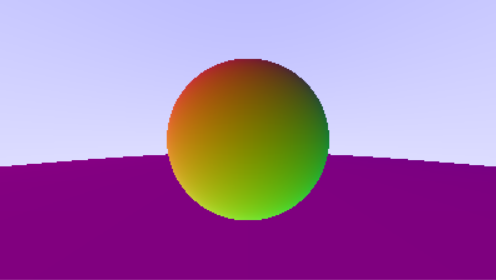

# Small graphic project 
mainly for when i'm either really bored or really motivated

## Recognitions
This is in no way, shape or form original, it is inspired by the work of [Peter Shirley](https://github.com/petershirley), [Trevor David Black](https://github.com/trevordblack), [Steve Hollasch](https://github.com/hollasch), "Ray tracing in one weekend".

### Additions
The 'ppm_runner.py' file is mine, it should be fast on most environments, taking the first argument as the ppm file :

`python ppm_runner.py your_ppm_file.ppm` will be a correct command. 

Resolutions beyond 1024pixels could not be tested because of the size of my screen.

### Problems encountered

wrong definition of normals

see the normals definitions in hittable.h (rays coming form the interior or to to the exterior of the surface)